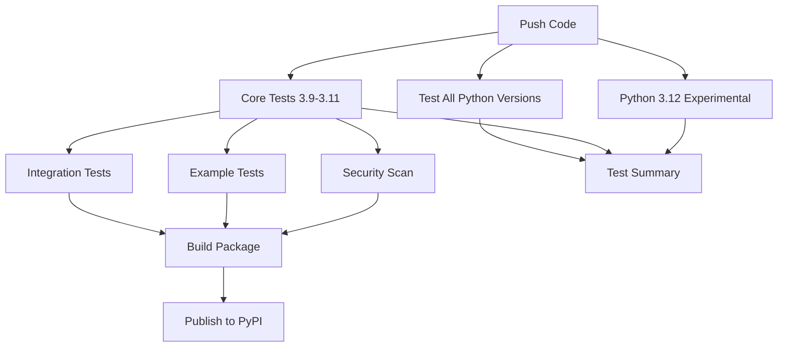

# OpenTelemetry Web Framework Tracing Library

A **vendor-agnostic** OpenTelemetry tracing library for Python web frameworks including Flask, Django, and FastAPI. This library provides **idempotent setup**, **singleton pattern**, and **easy vendor switching** for observability backends.

## 🚀 Features

- **🔧 Idempotent Setup**: Safe to call setup functions multiple times without side effects
- **🏢 Vendor-Agnostic**: Built-in support for Jaeger, OTLP, and extensible to other vendors
- **🌐 Multi-Framework**: Support for Flask, Django, and FastAPI
- **⚙️ Environment-Driven**: Configure via environment variables
- **🔒 Thread-Safe**: Singleton pattern with proper locking
- **📊 Comprehensive**: Includes HTTP client instrumentation (requests, urllib3)

## 📦 Installation

### Basic Installation
```bash
pip install otel-web-tracing
```

### Framework-Specific Installation
```bash
# For Flask
pip install otel-web-tracing[flask]

# For Django  
pip install otel-web-tracing[django]

# For FastAPI
pip install otel-web-tracing[fastapi]

# For all frameworks
pip install otel-web-tracing[all]

# For development
pip install otel-web-tracing[dev]
```

## 🔧 Quick Start

### Flask Application

```python
from flask import Flask, jsonify
from otel_web_tracing import setup_flask_tracing

app = Flask(__name__)

# Setup tracing (idempotent - safe to call multiple times)
tracer = setup_flask_tracing(
    app, 
    service_name="my-flask-app",
    excluded_urls=["/health", "/metrics"]
)

@app.route("/")
def hello():
    return jsonify({"message": "Hello World!"})

if __name__ == "__main__":
    app.run()
```

### Django Application

```python
# In your Django settings.py
from otel_web_tracing import setup_django_tracing

# Setup tracing
tracer = setup_django_tracing(
    service_name="my-django-app",
    excluded_urls=["/admin/", "/health/"]
)
```

### FastAPI Application

```python
from fastapi import FastAPI
from otel_web_tracing import setup_fastapi_tracing

app = FastAPI()

# Setup tracing
tracer = setup_fastapi_tracing(
    app,
    service_name="my-fastapi-app",
    excluded_urls=["/health", "/docs"]
)

@app.get("/")
async def root():
    return {"message": "Hello World!"}
```

## ⚙️ Configuration

Configure the library using environment variables:

### Basic Configuration
```bash
export OTEL_SERVICE_NAME="my-web-service"
export OTEL_SERVICE_VERSION="1.0.0"
export OTEL_DEPLOYMENT_ENVIRONMENT="production"
```

### Exporter Configuration

#### Jaeger (Default)
```bash
export OTEL_EXPORTER_TYPE="jaeger"
export OTEL_EXPORTER_JAEGER_AGENT_HOST="localhost"
export OTEL_EXPORTER_JAEGER_AGENT_PORT="6831"
```

#### OTLP (OpenTelemetry Protocol)
```bash
export OTEL_EXPORTER_TYPE="otlp"
export OTEL_EXPORTER_OTLP_ENDPOINT="http://localhost:4317"
export OTEL_EXPORTER_OTLP_PROTOCOL="grpc"  # or "http/protobuf"
export OTEL_EXPORTER_OTLP_HEADERS="Authorization=Bearer your-token"
```

#### Console (Development)
```bash
export OTEL_EXPORTER_TYPE="console"
```

#### Multiple Exporters
```bash
export OTEL_EXPORTER_TYPE="multi"
# This will enable both Jaeger and OTLP exporters
```

## 🏢 Vendor-Specific Configurations

### Datadog
```bash
export OTEL_EXPORTER_TYPE="otlp"
export OTEL_EXPORTER_OTLP_ENDPOINT="https://trace.agent.datadoghq.com"
export OTEL_EXPORTER_OTLP_HEADERS="DD-API-KEY=your-datadog-api-key"
```

### Dynatrace
```bash
export OTEL_EXPORTER_TYPE="otlp"
export OTEL_EXPORTER_OTLP_ENDPOINT="https://your-environment.live.dynatrace.com/api/v2/otlp/v1/traces"
export OTEL_EXPORTER_OTLP_HEADERS="Authorization=Api-Token your-dynatrace-token"
```

### New Relic
```bash
export OTEL_EXPORTER_TYPE="otlp"
export OTEL_EXPORTER_OTLP_ENDPOINT="https://otlp.nr-data.net:4317"
export OTEL_EXPORTER_OTLP_HEADERS="api-key=your-new-relic-license-key"
```

### Honeycomb
```bash
export OTEL_EXPORTER_TYPE="otlp"
export OTEL_EXPORTER_OTLP_ENDPOINT="https://api.honeycomb.io"
export OTEL_EXPORTER_OTLP_HEADERS="x-honeycomb-team=your-api-key,x-honeycomb-dataset=your-dataset"
```

## 🐳 Running Jaeger Locally

### Using Docker
```bash
# Run Jaeger all-in-one
docker run -d --name jaeger \
  -p 16686:16686 \
  -p 14268:14268 \
  -p 6831:6831/udp \
  jaegertracing/all-in-one:latest

# Access Jaeger UI at http://localhost:16686
```

### Using Docker Compose
```yaml
# docker-compose.yml
version: '3.9'
services:
  jaeger:
    image: jaegertracing/all-in-one:latest
    ports:
      - "16686:16686"
      - "14268:14268"
      - "6831:6831/udp"
    environment:
      - COLLECTOR_OTLP_ENABLED=true
```

## 📊 OpenTelemetry Collector Configuration

### Basic OTLP Collector Config
```yaml
# otel-collector-config.yaml
receivers:
  otlp:
    protocols:
      grpc:
        endpoint: 0.0.0.0:4317
      http:
        endpoint: 0.0.0.0:4318

processors:
  batch:

exporters:
  jaeger:
    endpoint: jaeger:14250
    tls:
      insecure: true
  
  # Add other exporters as needed
  datadog:
    api:
      key: "${DD_API_KEY}"
      site: datadoghq.com

service:
  pipelines:
    traces:
      receivers: [otlp]
      processors: [batch]
      exporters: [jaeger, datadog]
```

### Running the Collector
```bash
docker run -p 4317:4317 -p 4318:4318 \
  -v $(pwd)/otel-collector-config.yaml:/etc/otel-collector-config.yaml \
  otel/opentelemetry-collector:latest \
  --config=/etc/otel-collector-config.yaml
```

## 🧪 Testing

Run the test suite:

```bash
# Install development dependencies
pip install -e .[dev]

# Run tests
pytest

# Run tests with coverage
pytest --cov=otel_web_tracing --cov-report=html

# Run specific test file
pytest tests/test_tracer.py -v
```

## 🧑‍💻 Type Checking (for Beginners)

### How We Use Type Checking in This Project

- **Type Hints Everywhere:**  
  All core modules (`src/otel_tracer/`) use Python type hints for function arguments, return values, and class attributes. This makes the code easier to read, maintain, and catch bugs early.

- **Checked with `mypy`:**  
  We use [mypy](https://mypy.readthedocs.io/en/stable/) in CI and recommend running it locally. It checks that the code matches the declared types and helps prevent subtle bugs.

- **Type-Checked Libraries:**
  - **Standard Library:** Uses Python's built-in `typing` module (e.g., `Optional`, `Dict`, `Any`, `Union`).
  - **Third-Party:**
    - OpenTelemetry SDK and instrumentations provide their own type hints.
    - If a third-party library lacks type hints, we use `# type: ignore` as needed (rarely).
  - **No runtime enforcement:** Type hints are for static analysis only; they don't affect runtime behavior.

- **Type Checking in CI:**  
  Our CI pipeline runs `mypy src` and fails if there are type errors. This ensures all merged code is type-safe.

- **Type Checking in Tests:**  
  You can also run `mypy tests` to check type safety in the test suite, though the main focus is on the library code.

- **Type Checking for Contributors:**
  - If you add new code, please include type hints for all public functions and classes.
  - If you see a `# type: ignore`, check if it's still needed—sometimes upstream libraries add type hints later.

#### Example from This Codebase

```python
from typing import Optional, Dict, Any, Union

def create_exporter(
    exporter_type: Union[ExporterType, str],
    endpoint: Optional[str] = None,
    headers: Optional[Dict[str, str]] = None,
    **kwargs: Any,
) -> SpanExporter:
    ...
```
- All arguments and the return value are type-annotated.
- This function is checked by `mypy` in CI and locally.

#### Libraries Used for Type Checking

- **[mypy](https://mypy.readthedocs.io/en/stable/):** Static type checker for Python.
- **[typing](https://docs.python.org/3/library/typing.html):** Standard library for type hints.
- **[types-](https://pypi.org/search/?q=types-):** Some dependencies may use stub packages (e.g., `types-requests`) for type hints if the main package doesn't provide them.

#### How to Run Type Checking

```bash
# Check the main codebase
mypy src

# (Optional) Check the tests
mypy tests
```

**If you're new to type hints or mypy, see the rest of this section for more details and resources!**

---

### 🛠️ Common mypy Issues & How We Handle Them

This project uses optional dependencies and dynamic imports, so you may see mypy errors like these:

| Error | Solution |
|-------|----------|
| Assigning `None` to a type | Use `Optional[...]` in the annotation |
| Assigning `None` to a `Callable` | Use `Optional[Callable[...]]` |
| Missing stubs for imports | Add `# type: ignore[import]` or set `ignore_missing_imports = True` |
| Missing function annotations | Add type hints to all function arguments and return values |
| Django/Starlette missing stubs | Use `# type: ignore[import]` or `ignore_missing_imports = True` |

#### Practical Examples

**1. Optional Imports:**
```python
from typing import Optional

try:
    from opentelemetry.instrumentation.flask import FlaskInstrumentor
except ImportError:
    FlaskInstrumentor = None  # type: ignore[assignment]

FlaskInstrumentor: Optional[type] = FlaskInstrumentor
```

**2. Optional Callable:**
```python
from typing import Optional, Callable

try:
    from ..database import setup_database_tracing
except ImportError:
    setup_database_tracing = None  # type: ignore[assignment]

setup_database_tracing: Optional[Callable[..., None]] = setup_database_tracing
```

**3. Missing Stubs for Imports:**
```python
from opentelemetry.instrumentation.starlette import StarletteInstrumentor  # type: ignore[import]
from django.conf import settings  # type: ignore[import]
```

**4. Missing Function Annotations:**
```python
def my_function(arg: int) -> str:
    return str(arg)

def setup_tracing(config: TracingConfig, force_reinit: bool = False) -> None:
    ...
```

**5. Configuring mypy to Ignore Missing Imports (if needed):**
Add to your `mypy.ini` or `pyproject.toml`:
```ini
[mypy]
ignore_missing_imports = True
```

---

## 🏗️ Architecture & Design Patterns

### 🎯 **Singleton Pattern Explained (For Beginners)**

This project uses the **Singleton Pattern** - a design pattern that ensures only **one instance** of a class exists throughout your application. Think of it like having only one "master control center" for tracing.

#### **Why Use Singleton Pattern?**

**Problem without Singleton**:
```python
# ❌ BAD: Multiple tracer instances
tracer1 = setup_flask_tracing(app, service_name="my-app")
tracer2 = setup_flask_tracing(app, service_name="my-app")  # Creates another instance!
tracer3 = setup_flask_tracing(app, service_name="my-app")  # And another!

# Result: Multiple tracers sending duplicate data, wasting resources
```

**Solution with Singleton**:
```python
# ✅ GOOD: Same tracer instance reused
tracer1 = setup_flask_tracing(app, service_name="my-app")
tracer2 = setup_flask_tracing(app, service_name="my-app")  # Returns same instance
tracer3 = setup_flask_tracing(app, service_name="my-app")  # Returns same instance

print(tracer1 is tracer2 is tracer3)  # True - same object!
```

#### **How Our Singleton Works**

**1. Thread-Safe Implementation**:
```python
import threading

class OTelTracer:
    _instance = None
    _lock = threading.Lock()  # Prevents race conditions
    
    def __new__(cls):
        if cls._instance is None:
            with cls._lock:  # Only one thread can create instance
                if cls._instance is None:
                    cls._instance = super().__new__(cls)
        return cls._instance
```

**2. Idempotent Setup** (Safe to call multiple times):
```python
# You can call this as many times as you want
setup_flask_tracing(app, service_name="my-app")
setup_flask_tracing(app, service_name="my-app")  # No problem!
setup_flask_tracing(app, service_name="my-app")  # Still fine!

# Only the first call actually sets up tracing
# Subsequent calls return the existing tracer
```

#### **Real-World Example**

```python
from flask import Flask
from otel_web_tracing import setup_flask_tracing

app = Flask(__name__)

# First call - creates the tracer
tracer1 = setup_flask_tracing(app, service_name="my-app")
print(f"Tracer 1 ID: {id(tracer1)}")

# Second call - returns the SAME tracer
tracer2 = setup_flask_tracing(app, service_name="my-app")
print(f"Tracer 2 ID: {id(tracer2)}")

# Third call - still the SAME tracer
tracer3 = setup_flask_tracing(app, service_name="my-app")
print(f"Tracer 3 ID: {id(tracer3)}")

# Output:
# Tracer 1 ID: 140234567890123
# Tracer 2 ID: 140234567890123  # Same ID!
# Tracer 3 ID: 140234567890123  # Same ID!
```

#### **Benefits in Our Project**

1. **🚫 No Duplicate Traces**: Only one tracer sends data
2. **💾 Memory Efficient**: One instance instead of many
3. **🔧 Easy Configuration**: Set once, use everywhere
4. **🧵 Thread Safe**: Works in multi-threaded applications
5. **🔄 Idempotent**: Safe to call setup multiple times

#### **When Singleton is Reset**

The singleton instance is reset when:
```python
# During testing (automatic cleanup)
pytest tests/  # Each test gets a fresh tracer

# Manual reset (advanced usage)
from otel_web_tracing.tracer import OTelTracer
OTelTracer._instance = None  # Reset singleton
```

#### **Conflict Detection & Resolution**

**Problem**: What if another library already set up OpenTelemetry?

```python
# ❌ POTENTIAL CONFLICT: Another library sets up OpenTelemetry
import some_other_library
some_other_library.setup_tracing()  # Sets up OpenTelemetry

# Now our library tries to set up tracing
from otel_tracer import setup_flask_tracing
tracer = setup_flask_tracing(app, service_name="my-app")  # What happens?
```

**Solution**: Our library detects existing setup and handles it gracefully:

```python
from otel_tracer import setup_flask_tracing, is_tracer_already_initialized

# Check if OpenTelemetry is already set up
if is_tracer_already_initialized():
    print("OpenTelemetry already initialized by external code")

# Set up tracing (safe even if already initialized)
tracer = setup_flask_tracing(app, service_name="my-app")
# ✅ Works! Uses existing tracer or creates new one as needed
```

**Force Override** (when you need your specific configuration):
```python
# Force override existing setup
tracer = setup_flask_tracing(
    app, 
    service_name="my-app",
    exporter_type="jaeger",
    force_reinit=True  # Override existing setup
)
```

#### **Common Beginner Questions**

**Q: What if I want different tracers for different services?**
```python
# ✅ Use different service names
tracer1 = setup_flask_tracing(app1, service_name="user-service")
tracer2 = setup_flask_tracing(app2, service_name="order-service")
# Same tracer instance, but different service names in traces
```

**Q: Is this thread-safe?**
```python
# ✅ Yes! Multiple threads can safely call setup
import threading

def setup_tracing():
    setup_flask_tracing(app, service_name="my-app")

# All threads will get the same tracer instance
threads = [threading.Thread(target=setup_tracing) for _ in range(10)]
for t in threads:
    t.start()
```

**Q: What happens in tests?**
```python
# ✅ Automatic cleanup between tests
def test_tracing_1():
    tracer = setup_flask_tracing(app, service_name="test-1")
    # Test code here

def test_tracing_2():
    tracer = setup_flask_tracing(app, service_name="test-2")
    # Gets a fresh tracer instance (singleton reset between tests)
```

**Q: What if another library already set up OpenTelemetry?**
```python
# ✅ Library detects and handles gracefully
from otel_tracer import is_tracer_already_initialized

# Check first
if is_tracer_already_initialized():
    print("Already set up by external code")

# Set up anyway (safe)
tracer = setup_flask_tracing(app, service_name="my-app")

# Force your configuration if needed
tracer = setup_flask_tracing(app, service_name="my-app", force_reinit=True)
```

### Core Components

1. **OTelTracer**: Singleton tracer manager with vendor-agnostic exporter support
2. **Framework Modules**: Flask, Django, and FastAPI specific instrumentation
3. **Exporter Factory**: Dynamic exporter creation based on configuration
4. **Thread Safety**: Proper locking for singleton pattern

### Extension Points

Adding support for new vendors is straightforward:

```python
# In your application
import os
from otel_web_tracing.tracer import OTelTracer

# Custom exporter configuration
os.environ["OTEL_EXPORTER_TYPE"] = "custom"
os.environ["CUSTOM_EXPORTER_ENDPOINT"] = "https://your-vendor.com"

# Extend the OTelTracer class or contribute back to the library
```

## 🤝 Contributing

1. Fork the repository
2. Create a feature branch: `git checkout -b feature/amazing-feature`
3. Make your changes and add tests
4. Run the test suite: `pytest`
5. Commit your changes: `git commit -m 'Add amazing feature'`
6. Push to the branch: `git push origin feature/amazing-feature`
7. Open a Pull Request

## 🔄 CI/CD Pipeline Explained

Our project uses **GitHub Actions** for automated testing, building, and publishing. Here's a beginner-friendly explanation of what happens when you push code:

### 📁 Pipeline Configuration
**Location**: `.github/workflows/ci.yml`

### 🎯 Pipeline Overview


### 🧪 **Test Jobs Explained**

#### 1. **Main Test Job** (`test`)
**Purpose**: Tests all Python versions (3.9, 3.10, 3.11, 3.12)

**What happens**:
```bash
# 1. Install dependencies
pip install -e .[dev,all]

# 2. Code quality checks
flake8 src tests          # Check code style and syntax
black --check src tests   # Verify code formatting
mypy src                  # Type checking

# 3. Run comprehensive tests
pytest --cov=otel_tracer --cov-report=xml -v
```

**Key Features**:
- `fail-fast: false` - If Python 3.9 fails, Python 3.10 still runs
- `continue-on-error: true` for Python 3.12 - Can fail without breaking pipeline
- Uploads coverage reports to Codecov for tracking

#### 2. **Core Test Job** (`core-test`)
**Purpose**: Tests stable Python versions (3.9-3.11) that deployment depends on

**Why separate**: Python 3.12 issues won't block your releases

**Dependencies**: Other critical jobs wait for this to pass

#### 3. **Python 3.12 Test** (`test-python312`)
**Purpose**: Test experimental Python 3.12 support

**Special behavior**: 
- Can fail without affecting other jobs
- Logs failures for future compatibility work
- Doesn't block deployment

### 🔗 **Integration Tests**
**Purpose**: Test with real services (not mocks)

**Services started**:
```yaml
services:
  jaeger:
    image: jaegertracing/all-in-one:1.51
    ports:
      - 16686:16686  # Jaeger UI
      - 14268:14268  # Jaeger collector
      - 6831:6831/udp # Jaeger agent
```

**What it tests**:
```bash
# Wait for Jaeger to be ready
timeout 60 bash -c 'until curl -f http://localhost:16686; do sleep 2; done'

# Test real tracing pipeline
OTEL_EXPORTER_TYPE=jaeger pytest tests/integration/ -v
```

### 📝 **Example Tests**
**Purpose**: Verify example applications work correctly

**Flask example test**:
```bash
# Start Flask app in background
timeout 30 python examples/flask_app.py &
sleep 5

# Test endpoints
curl -f http://localhost:5000/
curl -f http://localhost:5000/api/users/1

# Clean up
pkill -f flask_app.py
```

**FastAPI example test**:
```bash
# Start FastAPI app
timeout 30 python examples/fastapi_app.py &
sleep 5

# Test endpoints
curl -f http://localhost:8000/
curl -f http://localhost:8000/api/users

# Clean up
pkill -f fastapi_app.py
```

### 🔒 **Security Scanning**
**Tools used**:
- **Safety**: Checks dependencies for known vulnerabilities
- **Bandit**: Static security analysis of Python code

**Commands**:
```bash
# Check for vulnerable dependencies
safety check --json

# Scan source code for security issues
bandit -r src/ -f json
```

### 📦 **Build & Publish**

#### **Build Job**
```bash
# Install build tools
pip install build twine

# Create wheel and source distribution
python -m build

# Validate the package
twine check dist/*

# Upload as artifact for publishing
```

#### **Publish Job** (Only on releases)
**Trigger**: When you create a GitHub release
**What it does**: Automatically publishes to PyPI
**Security**: Uses encrypted `PYPI_API_TOKEN` secret

### 🎮 **How to Trigger CI/CD**

1. **Push to main/develop**: Runs all tests
   ```bash
   git push origin main
   ```

2. **Create Pull Request**: Runs all tests
   ```bash
   git checkout -b feature/my-feature
   git push origin feature/my-feature
   # Create PR on GitHub
   ```

3. **Create Release**: Runs tests + publishes to PyPI
   ```bash
   git tag v0.2.0
   git push origin v0.2.0
   # Create release on GitHub
   ```

### 📊 **Monitoring CI/CD**

**View Results**:
1. Go to your GitHub repository
2. Click "Actions" tab
3. See all workflow runs and their status

**Coverage Reports**:
- Automatically uploaded to Codecov
- View detailed coverage at: `https://codecov.io/gh/rgunkar/otel-web-tracing`

## 🐳 Docker & Development Environment Explained

### 📁 **Docker Files Overview**

Our project includes a complete observability stack for development and testing.

#### 1. **docker-compose.yml** - Complete Development Stack

**Purpose**: Sets up a full observability environment with one command

**Services included**:

```yaml
# 🔍 Jaeger - Distributed Tracing Backend
jaeger:
  image: jaegertracing/all-in-one:1.51
  ports:
    - "16686:16686"  # 🌐 Jaeger UI (web interface)
    - "14268:14268"  # 📡 HTTP collector endpoint
    - "6831:6831/udp" # 📡 UDP agent endpoint
  environment:
    - COLLECTOR_OTLP_ENABLED=true

# 🔄 OpenTelemetry Collector - Data Processing Hub
otel-collector:
  image: otel/opentelemetry-collector-contrib:0.89.0
  ports:
    - "4317:4317"   # 📡 OTLP gRPC endpoint
    - "4318:4318"   # 📡 OTLP HTTP endpoint
    - "8889:8889"   # 📊 Metrics endpoint
  volumes:
    - ./otel-collector-config.yaml:/etc/otel-collector-config.yaml
  command: ["--config=/etc/otel-collector-config.yaml"]

# 📊 Prometheus - Metrics Storage
prometheus:
  image: prom/prometheus:v2.47.0
  ports:
    - "9090:9090"   # 🌐 Prometheus UI
  volumes:
    - ./prometheus.yml:/etc/prometheus/prometheus.yml

# 📈 Grafana - Data Visualization
grafana:
  image: grafana/grafana:10.1.0
  ports:
    - "3000:3000"   # 🌐 Grafana UI
  environment:
    - GF_SECURITY_ADMIN_PASSWORD=admin
```

#### 2. **otel-collector-config.yaml** - Data Pipeline Configuration

**Purpose**: Configures how telemetry data flows through the system

**Pipeline Structure**:
```yaml
# 📥 RECEIVERS - How data comes in
receivers:
  otlp:
    protocols:
      grpc:
        endpoint: 0.0.0.0:4317  # Accept gRPC connections
      http:
        endpoint: 0.0.0.0:4318  # Accept HTTP connections

# ⚙️ PROCESSORS - How data is processed
processors:
  batch:
    timeout: 1s              # Batch data for efficiency
    send_batch_size: 1024    # Send in batches of 1024

# 📤 EXPORTERS - Where data goes
exporters:
  jaeger:
    endpoint: jaeger:14250   # Send to Jaeger
    tls:
      insecure: true
  prometheus:
    endpoint: "0.0.0.0:8889" # Expose metrics for Prometheus

# 🔄 SERVICE - Connect everything together
service:
  pipelines:
    traces:
      receivers: [otlp]      # Receive from OTLP
      processors: [batch]    # Process in batches
      exporters: [jaeger]    # Send to Jaeger
    metrics:
      receivers: [otlp]
      processors: [batch]
      exporters: [prometheus]
```

#### 3. **prometheus.yml** - Metrics Collection Configuration

**Purpose**: Tells Prometheus where to collect metrics from

```yaml
global:
  scrape_interval: 15s     # How often to collect metrics

scrape_configs:
  - job_name: 'otel-collector'
    static_configs:
      - targets: ['otel-collector:8889']  # Collect from collector
  - job_name: 'prometheus'
    static_configs:
      - targets: ['localhost:9090']       # Self-monitoring
```

### 🚀 **Using the Development Environment**

#### **Start Everything**
```bash
# Start all services in background
docker-compose up -d

# View logs from all services
docker-compose logs -f

# View logs from specific service
docker-compose logs -f jaeger
```

#### **Access the Services**

| Service | URL | Purpose | Login |
|---------|-----|---------|-------|
| 🔍 Jaeger UI | http://localhost:16686 | View distributed traces | None |
| 📊 Prometheus | http://localhost:9090 | Query metrics and alerts | None |
| 📈 Grafana | http://localhost:3000 | Create dashboards | admin/admin |
| 📡 OTLP Collector | http://localhost:4318 | Send telemetry data | None |

#### **Complete Development Workflow**

1. **Start the observability stack**:
   ```bash
   docker-compose up -d
   ```

2. **Install your project in development mode**:
   ```bash
   pip install -e .[dev,all]
   ```

3. **Create a test application**:
   ```python
   # test_app.py
   from flask import Flask
   from otel_web_tracing import setup_flask_tracing
   
   app = Flask(__name__)
   tracer = setup_flask_tracing(
       app,
       service_name="my-test-app",
       exporter_type="otlp",
       otlp_endpoint="http://localhost:4318"
   )
   
   @app.route("/")
   def hello():
       return "Hello, World!"
   
   if __name__ == "__main__":
       app.run(debug=True)
   ```

4. **Run your application**:
   ```bash
   python test_app.py
   ```

5. **Generate some traffic**:
   ```bash
   # Make some requests
   curl http://localhost:5000/
   curl http://localhost:5000/
   curl http://localhost:5000/
   ```

6. **View the results**:
   - **Traces**: Open http://localhost:16686
     - Select "my-test-app" from service dropdown
     - Click "Find Traces"
     - Click on a trace to see details
   
   - **Metrics**: Open http://localhost:9090
     - Try query: `http_requests_total`
   
   - **Dashboards**: Open http://localhost:3000
     - Login: admin/admin
     - Create custom dashboards

7. **Stop everything when done**:
   ```bash
   docker-compose down
   ```

### 🔧 **Development Commands**

```bash
# Start services
docker-compose up -d

# Check service status
docker-compose ps

# View logs
docker-compose logs -f [service-name]

# Restart a service
docker-compose restart jaeger

# Stop services
docker-compose stop

# Remove everything (including volumes)
docker-compose down -v

# Rebuild services (if you change config)
docker-compose up -d --build
```

### 🐛 **Troubleshooting Docker**

**Common Issues**:

1. **Port already in use**:
   ```bash
   # Check what's using the port
   lsof -i :16686
   
   # Kill the process or change ports in docker-compose.yml
   ```

2. **Services not starting**:
   ```bash
   # Check logs for errors
   docker-compose logs jaeger
   docker-compose logs otel-collector
   
   # Check if containers are running
   docker-compose ps
   ```

3. **Can't connect to services**:
   ```bash
   # Make sure services are up
   curl http://localhost:16686
   
   # Check Docker network
   docker network ls
   docker network inspect otel-web-tracing_default
   ```

4. **Reset everything**:
   ```bash
   # Nuclear option - remove everything
   docker-compose down -v
   docker system prune -f
   docker-compose up -d
   ```

### 🎯 **What Each Service Does**

- **🔍 Jaeger**: Stores and visualizes distributed traces
- **🔄 OTLP Collector**: Receives, processes, and routes telemetry data
- **📊 Prometheus**: Stores and queries metrics data
- **📈 Grafana**: Creates beautiful dashboards and alerts

This setup gives you a **production-like observability environment** on your local machine!

## 📋 Requirements

- Python 3.9+
- OpenTelemetry SDK 1.20.0+
- Framework-specific dependencies (installed with extras)
- Docker & Docker Compose (for development environment)

## 🔄 Changelog

### v0.1.0
- Initial release
- Support for Flask, Django, FastAPI
- Jaeger and OTLP exporters
- Vendor-agnostic architecture
- Comprehensive test suite
- Complete CI/CD pipeline
- Docker development environment

## 📄 License

This project is licensed under the MIT License - see the LICENSE file for details.

## 🆘 Support

- **Issues**: [GitHub Issues](https://github.com/rgunkar/otel-web-tracing/issues)
- **Discussions**: [GitHub Discussions](https://github.com/rgunkar/otel-web-tracing/discussions)
- **Documentation**: [Full Documentation](https://rgunkar.github.io/otel-web-tracing/)

## 🌟 Acknowledgments
